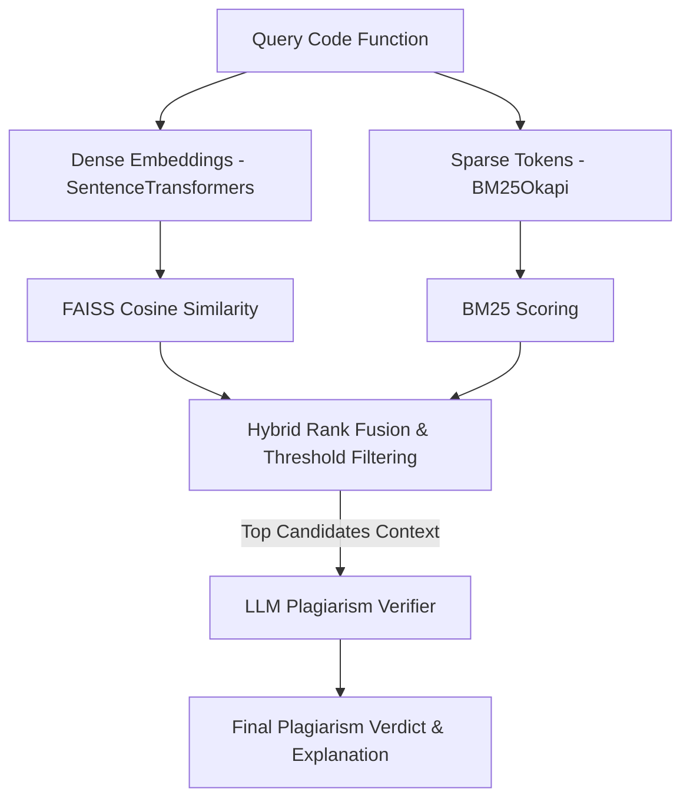

# Code Plagiarism Detection with RAG Systems

An advanced code plagiarism detection pipeline utilizing Retrieval-Augmented Generation (RAG) and hybrid search (dense embeddings + sparse keyword search) to identify code copying, variable renaming, restructuring, and reformatting.

## 🚀 Key Features

- **Hybrid Candidate Retrieval**: Combines semantic embeddings (Dense FAISS search) and exact keyword matching (Sparse BM25 search) using a weighted rank fusion mechanism.
- **RAG-based Plagiarism Verification**: Leverages modern Large Language Models (`gpt-4o-mini`) configured with conservative verifier prompts to analyze logic, syntax structures, and semantic similarity.
- **Robustness to Obfuscation**: Detects plagiarism even when variables are renamed, comments are stripped, and helper functions are re-ordered or refactored.
- **Comprehensive Evaluation Pipeline**: Includes performance benchmarks (Accuracy, Precision, Recall, F1-Score) compared across 4 detection methodologies.

---

## 🛠️ Architecture Overview

The system runs in three distinct stages:



1. **Indexing**: 
   - Extract code segments at the function-level (over 5,900 reference functions).
   - Generate embeddings using the `all-MiniLM-L6-v2` transformer.
   - Build a FAISS flat inner product index and initialize a BM25 Okapi model.

2. **Retrieval**:
   - Query code is vectorized and queried against the FAISS index to retrieve the top $K$ semantic matches.
   - Query code is tokenized and searched against BM25 to find exact syntactic overlap.
   - Scores are normalized and combined using a weighted schema ($0.7 \times \text{Dense} + 0.3 \times \text{BM25}$).

3. **LLM Verification**:
   - Candidates that exceed the pre-filter thresholds are formatted into a prompt context.
   - The LLM acts as a strict, conservative verifier to output a binary decision (`VERDICT: YES/NO`) along with a logical reason.

---

## 📊 Performance Evaluation

The methods were evaluated against a test dataset (`data/test_dataset.json`) consisting of 34 instances (13 positive plagiarism cases with variable renamings/structure modifications, and 21 negative cases).

| Detection Methodology | Precision | Recall | F1-Score | Accuracy |
| :--- | :---: | :---: | :---: | :---: |
| **Embedding Similarity Only** | 0.524 | 0.846 | **0.647** | 64.7% |
| **Direct LLM (Random Sample)** | 0.333 | 0.154 | **0.222** | 58.8% |
| **Standard RAG (FAISS + LLM)** | 0.394 | 1.000 | **0.558** | 44.1% |
| **Hybrid RAG (Dense + BM25 + LLM)** | 0.500 | 0.846 | **0.629** | **61.8%** |

### Insights:
- **Embedding Similarity** yields a high recall but suffers from false positives when code shares common boilerplate structures.
- **Hybrid RAG** balances precision and accuracy well by pre-filtering candidates and utilizing LLM reasoning, achieving the highest overall accuracy of **61.8%**.
- **Direct LLM (no retrieval)** fails significantly due to context size limitations and lack of focused candidates.

*Visual evaluation charts, including PR curves and ablation studies, are generated under the [results/](file:///Users/tekla/homework1_teklakilasonia%202/results) folder.*

---

## 📂 Project Structure

- `01_indexing.ipynb`: Index setup notebook. Loads the dataset, builds FAISS indices, creates the BM25 database, and saves them to the `indexes/` folder.
- `02_interactive.ipynb`: Interactive playground. Contains methods (`detect_embedding`, `detect_llm`, `detect_rag`, `detect_hybrid_rag`) to run queries against the active indexes.
- `03_evaluation.ipynb`: Benchmarking suite. Iterates through the test dataset, measures metrics, and generates visual charts (`results/`).
- `data/`:
  - `corpus_functions.json`: Database of reference python source code.
  - `reference_corpus/`: Raw python library files.
  - `test_dataset.json`: Evaluated queries labeled as plagiarized or original.
- `requirements.txt`: Python package requirements.

---

## ⚙️ Setup and Usage

### 1. Installation
Install the required packages:
```bash
pip install -r requirements.txt
```

### 2. Configure Environment
Set your OpenAI API key in your environment:
```bash
export OPENAI_API_KEY="your-openai-api-key"
```

### 3. Build Indexes
Run the indexing notebook (`01_indexing.ipynb`) to build models, create FAISS vectors, and save pickles locally.

### 4. Run Evaluation
Run `03_evaluation.ipynb` to execute the full evaluation suite and output metric plots under `results/`.
